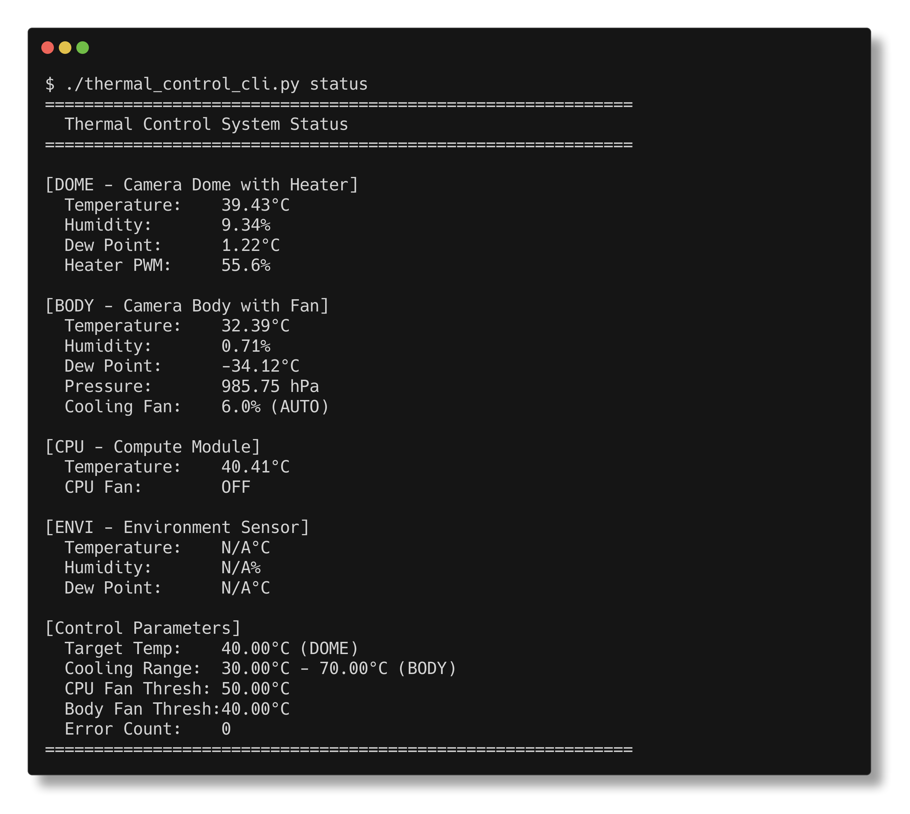

# AMASC01 – AstroMeters AllSky Camera

This is the main source repository for the [AstroMeters AMASC01 AllSky Camera](https://astrometers.eu/products/AMASC01/).
It contains open-source components used to monitor and control the hardware, and is primarily intended for
firmware/software development and customization of the camera.

## Repository layout

- `src/camera_supervisor/`  
  Python-based thermal control daemon and CLI for the AMASC01. It manages heating and ventilation around the
  optical dome (DOME/BODY/ENVI sensors) to maintain safe operating temperatures and helps prevent fogging and
  condensation during long-term outdoor operation.

- `src/allsky_modules/` (submodule)  
  AllSky modules and plugins specifically developed for AMASC01. These extend the [AllSky](https://github.com/AllskyTeam/allsky) 
  software with AMASC01-specific functionality such as thermal status overlays on captured images.
  
  The submodule tracks the `AMASC01` branch from [roman-dvorak/allsky-modules](https://github.com/roman-dvorak/allsky-modules/tree/AMASC01).

Additional firmware and support tools may be added under `src/` in the future as the platform evolves.

## Camera supervisor

For detailed documentation, installation and `systemd` integration, see [src/camera_supervisor/README.md](src/camera_supervisor/README.md)

### Quick status check

```bash
./src/camera_supervisor/thermal_control_cli.py status
```



## AllSky modules

The AMASC01-specific AllSky modules provide integration with the AllSky camera software:

- **allsky_amasc01_thermalstatus** – Reads thermal control status and overlays sensor data on captured images
- Additional modules for monitoring, control, and data export

To initialize the submodule after cloning:

```bash
git submodule update --init --recursive
```

For more information about AllSky modules, see the [allsky-modules repository](https://github.com/roman-dvorak/allsky-modules/tree/AMASC01).
